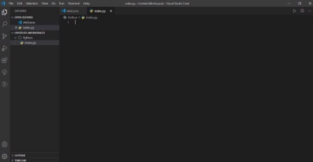

# **BAB 1**

# **Perkenalan Python**

### **Apa itu python dan penerapannya?**

Python merupakan bahasa pemrograman tingkat tinggi yang diracik oleh [Guido van Rossum](https://id.wikipedia.org/wiki/Guido_van_Rossum). Python adalah salah satu bahasa pemrograman komputer, yang belakangan ini banyak digunakan brand besar di seluruh dunia. Banyak teknologi mutakhir seperti machine learning dan situs web, menggunakan Python sebagai bahasa pemrogramannya.

Ada beberapa alasan yang mengharuskan Anda mempelajari Python sesegera mungkin, berikut beberapa diantaranya

1. Python adalah bahasa pemrograman paling populer.
1. Bahasa pemrograman yang _friendly_ pada pemula.
1. Sintaks yang sederhana.
1. Python memiliki sifat _open source_.
1. Tingkat fleksibilitas yang tinggi.
1. Memiliki komunitas di berbagai belahan dunia.
1. Memungkinkan pengembangan teknologi menjadi lebih besar.

Secara garis besar bahasa pemrograman Python adalah bahasa yang sangat fleksibel. Sehingga memungkinkan penggunanya membangun berbagai macam software. Lalu apa saja yang bisa Anda buat dengan bahasa pemrograman ini? Berikut beberapa diantaranya:

1. _Web Development_
1. _Data Analyst_
1. _Machine Learning_
1. Pengembangan AI (_Artificial Intelligence_)
1. Otomatisasi atau _Scripting_
1. Visualisasi Data
1. Pembuatan dan Pengujian Prototype
1. Software Pemecahan Masalah

### **Persiapan Pemrograman Python di Windows/Linux/MacOs**

Apa saja alat-alat yang harus dipersiapkan untuk belajar pemrograman

python?

1. Python: Interpreter yang menerjemahkan bahasa python ke bahasa mesin, sehingga program bisa dijalankan.
1. Teks Editor/IDE: Program yang digunakan untuk menulis kode.

#### **Python**

Bagi pengguna Linux, Python tidak perlu diinstal. Karena Sebagian besar distro Linux sudah menyediakannya secara default.

Untuk mengeceknya, silahkan ketik perintah python --version di terminal.


Bagi pengguna Windows, silahkan ikuti langkah-langkah berikut:

1. File Python interpreter bisa di download dari web resmi Python di [www.python.org](http://www.python.org) Silahkan buka alamat tersebut lalu klik menu “Download” .
1. Setelah file Python berhasil di download, kita bisa masuk ke proses instalasi. Klik dua kali file python-3.8.1.exe.


3. Selanjutnya akan tampil jendela awal instalasi Python seperti gambar dibawah ini:


Centang pilihan “Add Python 3.8 to PATH” di bagian bawah jendela (1). Ini berguna agar python interpreter bisa diakses dari lokasi mana saja. Setelah itu klik tombol “**Install Now**”

4. Proses instalasi akan berlangsung


5. Proses instalasi Python sudah selesai


Setelah selesai, akan tampil jendela “Setup was successful“. Langsung saja klik tombol “Close“.

Bagi pengguna Mac OS dan juga Linux yang belum terdapat Python silahkan lakukan langkah-langkah yang sama dengan pengguna windows, karena website Python bisa mendeteksi sistem operasi yang kita gunakan.

#### **Text Editor/IDE**

Terdapat banyak sekali Text Editor ataupun IDE untuk menjalankan Python. salah satunya adalah Visual Studio Code. Berikut adalah langkah instalasi Visual Studio Code:

1. Install VS Code terlebih dahulu melalui link https://code.visualstudio.com/


2. Setelah itu, buka VSCode dan buatlah sebuah file baru dengan nama index.py. Pada contoh berikut, saya meletakkan file index.py didalam folder Python.



3. Mari kita menuliskan code print(“Hello World”) pada editor. Kita akan mencoba menjalankan dengan mengklik tanda panah yang dilingkari seperti pada gambar. Anda juga bisa menggunakan shortcut Ctrl + Shift + D


4. Pada bagian Ekstensions (Ctrl + Shift + X) VS Code, carilah ekstension Python dan install seperti pada gambar berikut. Ikuti perintah selanjutnya seperti pada bagian sudut kanan bawah, kita diminta untuk menginstall Linter. Silakan klik install pada Linter tersebut.


5. Akan terlihat proses pengunduhan Linter seperti dibawah ini


6. Pada gambar berikut, terdapat contoh jika terdapat warning. Silakan upgrade dengan menjalankan perintah ‘python -m pip install — upgrade pip’ pada tab terminal.


7. Jalankan kembali kode ini dengan klik kanan dan pilih “run python file in terminal”. Shortcut : Ctrl + Shift + D


8. Perhatikan pada bagian terminal, jika menemukan tulisan “Hello World”, maka proses instalasi python di visual studio code sudah berhasil.


### **Aturan Penulisan Sintaks Python**

Terdapat beberapa aturan penulisan sintaks dalam python. Maksud adanya sintaks atau aturan ini adalah agar kode atau script yang ditulis dapat dibenarkan dan dimengerti oleh komputer. Berikut adalah aturan sintaks dalam python:

1. Penulisan Statement

Statement adalah sebuah instruksi atau kalimat perintah yang akan dieksekusi oleh komputer.

Penulisan satu statement tidak diakhiri dengan tanda titik-koma.

Contoh:

```
print("Hello World!")
```

```
print("Belajar Python dari Nol")
```

bila ingin menulis lebih dari satu statement dalam satu baris, maka harus memisahnya dengan titik-koma.

Contoh:

```
print("Hello"); print("World"); print("Belajar") nama_depan = "Iqbal"; nama_belakang = "Fatur"
```

2. Penulisan String

String adalah teks atau kumpulan dari karakter. String dalam pemrograman biasanya ditulis dengan dibungkus menggunakan tanda petik. Bisa menggunakan tanda petik tunggal maupun ganda.

Contoh:

```
judul = "Belajar Pemrograman Python disini"
penulis = 'Saya'
```

Atau bisa menggunakan triple tanda petik. Contoh:

```
judul = """Belajar Pemrograman Python disini"""
penulis = '''Saya'''
```

3. Penulisan Case

Sintak Python bersifat case sensitive, artinya ‘teksini’ dengan ‘TeksIni’ dibedakan.

Contoh:

```
judul = "Belajar Dasar-dasar Python"
Judul = "Belajar Membuat Program Python"
```

Antara variabel ‘judul’ dengan ‘Judul’ itu dibedakan.

4. Penulisan Blok Program

Blok program adalah kumpulan dari beberapa statement yang digabungkan dalam satu blok. Penulisan blok program harus ditambahkan indentasi (tab atau spasi 2x/4x).

Contoh penulisan benar:

- blok percabangan if

```
if username == 'saya':
    print("Hai")
    print("Selamat pagi")
```

- blok percabangan for

```
for i in range(10):
    print(i)
```

Contoh penulisan salah:

- blok percabangan if if username == 'saya': print("Hai") print("Selamat pagi")
- blok percabangan for

```
for i in range(10):
    print(i)
```

5. Cara Penulisan Komentar

Komentar merupakan baris kode yang tidak akan dieksekusi. Komentar digunakan untuk memberikan informasi tambahan dan untuk menonaktifkan kode.

Ada beberapa cara menulis komentar pada pemrograman Python.

1. Cara pertama menggunakan tanda pagar (#).

Cara ini paling sering digunakan.

Contoh:

```
# ini adalah komentar
# Ini juga komentar
```

2. Menggunakan Tanda Petik

Selain untuk mengapit teks (string), tanda petik juga dapat digunakan untuk membuat komentar.

Contoh:

```
"Ini adalah komentar dengan tanda petik ganda"
'Ini adalah komentar dengan tanda petik tunggal'
```

3. Menggunakan Triple Tanda Petik.

Sering digunakan untuk menuliskan dokumentasi.

```
class Coba:

"""kelas pagar untuk membuat objek Coba."""
def __init__(self, Aku, Kamu, Kita):

    self.Aku = Aku

    self.Kamu = Kamu

    self.Kita = Kita

# Mengakses dokumentasi kelas

print(Coba.__doc__)

input('\ntekan [enter] untuk melihat bantuan (dokumentasi) kelas: ')

help(Coba) # untuk melihat dokumentasi kelas
```

### **Tipe Data dan Variabel**

Variabel merupakan tempat menyimpan data, sedangkan tipe data adalah jenis data yang tersimpan dalam variabel. Variabel bersifat _mutable_, artinya nilainya bisa berubah-ubah.Terdapat aturan yang harus diingat dalam membuat variabel. Aturan tersebut yaitu variabel bersifat _case sensitive_ dan Nama variabel tidak boleh menggunakan kata kunci yang sudah ada dalam python seperti if, while, for, dan lain-lain.

1. Membuat Variabel

Variabel di python dapat dibuat dengan format seperti ini:

```
nama_variabel = <nilai>
```

Contoh:

```
ini_variabel = "ini isinya"
variabeljuga = 20
```

Kemudian untuk melihat isi variabel, kita dapat menggunakan fungsi ‘print’. Contoh:

```
print(ini_variabel)
print(variabeljuga)
```

2. Menghapus Variabel

Ketika sebuah variabel tidak dibutuhkan lagi, maka dapat dihapus dengan fungsi del().

Contoh:

```
del(ini_variabel)
print(ini_variabel)
```

Cara mengisi nilai variabel ditentukan dengan jenis datanya, misalkan untuk tipe data teks (string) maka harus diapit dengan tanda petik ("..."). Sedangkan untuk angka (integer) dan boolean tidak perlu diapit dengan tanda petik.

Contoh:

```
nama_ku = "Iqbal" umur = 19

tinggi = 175.2
```

Untuk memeriksa tipe data pada suatu variabel, kita bisa menggunakan fungsi type().

Secara umum, tipe data primitif dalam python dibagi menjadi tiga jenis:

1. Tipe data angka

Tipe data angka dibagi menjadi beberapa jenis lagi:

1. int (Integer): bilangan bulat, contoh 32, 22, 12, 10, dsb.
1. float: bilangan pecahan, contoh 1.3, 4.2, 22.3, dsb.

Contoh:

harga = 10000 #tipe int

berat = 55.12 #float

jarak = 3e3 #float 3000.0, huruf e artinya eksponen 10

2. Tipe data teks

Tipe data teks dibagi menjadi dua jenis lagi:

1. Char: Karakter, contoh 'A'.
1. String: Kumpulan karakter, contoh "aku lagi makan".

Contoh:

```
nama = "Iqbal"

jenis_kelamin = 'Laki-laki'

alamat = """

Jl. Suka Kamu, No 99. RT Kode,

Kelurahan Kapan jadian, Surabaya """

status = 'jomblo'
```

3. Tipe data boolean

Tipe data boolean adalah tipe data yang hanya memiliki dua nilai yaitu True dan False atau 0 dan 1.

Penulisan True dan False, huruf pertamanya harus kapital dan tanpa tanda petik.

Contoh:

```
hidup = True

nyala = 1 #sebenarnya tipenya int, tapi bisa juga menjadi bool
```

Konversi Tipe Data dapat dilakukan jika menginginkan hasil yang berbeda dari otomatisasi Python. Misal kita menginginkan hasil berupa float dari hasil pembagian bilangan yang bertipe data integer.

Contoh:

```
a = 20

b = 3

c = float(a) / float(b) #output: 6.666666666666667

print(c)
```

Fungsi-fungsi untuk mengubah tipe data:

1. int() untuk mengubah menjadi integer.
1. long() untuk mengubah menjadi integer panjang.
1. float() untuk mengubah menjadi float.
1. bool() untuk mengubah menjadi boolean.
1. chr() untuk mengubah menjadi karakter.
1. str() untuk mengubah menjadi string.
1. bin() untuk mengubah menjadi bilangan Biner.
1. hex() untuk mengubah menjadi bilangan Heksadesimal.
1. oct() untuk mengubah menjadi bilangan okta.

### **Input dan Output**

Input adalah masukan yang kita berikan ke program. Program akan memprosesnya dan menampilkan hasil outputnya. Input, proses, dan output adalah inti dari semua program komputer.

Cara mengambil input dari keyboard:

Python sudah menyediakan fungsi input() dan raw_input() untuk mengambil inputan dari keyboard.

Cara pakai:

```
nama_variabel = input("Sebuah Teks")
```

Cara Menampilkan Output:

Seperti yang sudah ada pada contoh-contoh sebelumnya. Untuk menampilkan output teks, dapat menggunakan fungsi print().

Contoh:

```
print("Hello World!")
```

Menampilkan Variabel dan Teks

Berikut adalah salah satu cara untuk menampilkan variabel dan teks.

```
nama = "Iqbal"

print ("Hello " + nama)
```

### **Operator**

Operator merupakan simbol-simbol yang digunakan untuk melakukan operasi tertentu. Ada enam jenis operator dalam pemrograman yang wajib diketahui:

1. Operator Aritmatika
1. Operator Pembanding/Relasi
1. Operator Penugasan
1. Operator Logika
1. Operator Bitwise
1. Operator Ternary

#### **Operator Aritmatika**

Operator aritmatika terdiri dari:

| **Operator** | **Simbol** |
| ------------ | ---------- |
| Penjumlahan  | +          |
| Pengurangan  | -          |
| Perkalian    | \*         |
| Pembagian    | /          |
| Sisa Bagi    | %          |
| Pemangkatan  | \*\*       |

Contoh Penggunaan:

- Ambil input untuk mengisi nilai a = input("Inputkan nilai a: ") b = input("Inputkan nilai b: ")
- Menggunakan operator penjumlahan

```
c = a + b

print("Hasil %d + %d = %d" % (a,b,c))
```

- Operator Pengurangan

```
c = a - b

print("Hasil %d + %d = %d" % (a,b,c))
```

- Operator Perkalian

```
c = a \* b

print("Hasil %d + %d = %d" % (a,b,c))
```

- Operator Pembagian

```
c = a / b

print("Hasil %d + %d = %d" % (a,b,c))
```

- Operator Sisa Bagi

```
c = a % b

print("Hasil %d + %d = %d" % (a,b,c))
```

- Operator Pangkat

```
c = a ** b

print("Hasil %d + %d = %d" % (a,b,c))
```

#### **Operator Penugasan**

Seperti namanya, operator ini digunakan untuk memberikan tugas pada variabel.

| **Operator** | **Simbol** |
| ------------ | ---------- |
| Pengisian    | =          |
| Penjumlahan  | +=         |
| Pengurangan  | -=         |
| Perkalian    | \*=        |
| Pembagian    | /=         |
| Sisa Bagi    | %=         |
| Pemangkatan  | \*\*=      |

Contoh Penggunaan:

```
# Variabel x dan y menggunakan operator penugasan

x = 1

y = 10

# Operator add AND +=

x+=y

print("hasil dari x+=y adalah: ", x)

# Operator subtract NAD -=

x=1 # Definisikan ulang x=1 krn setelah operasi x+=y maka x=11 x-=y

print("hasil dari x-=y adalah: ", x)

# Operator multiply AND *=

x=1 # Definisikan ulang x=1

x*=y

print("hasil dari x*=y adalah: ", x)

# Operator divide AND =

x=1 # Definisikan ulang x=1

x/=y

print("hasil dari x/=y adalah: ", x)

# Operator modulo AND

x=1 # Definisikan ulang x=1

x%=y

print("hasil dari x%=y adalah: ", x)

# Operator eksponen AND

x=1 # Definisikan ulang x=1

x**=y

print("hasil dari x\*\*=y adalah: ", x)

# Operator floor division

x=1 # Definisikan ulang x=1

x//=y

print("hasil dari x//=y adalah: ", x)
```

#### **Operator Pembanding**

Operator ini digunakan untuk membandingkan dua buah nilai. Operator ini juga dikenal dengan operator relasi dan sering digunakan untuk membuat sebuah logika atau kondisi.

| **Operator**            | **Simbol** |
| ----------------------- | ---------- |
| Lebih Besar             | >          |
| Lebih Kecil             | <          |
| Sama Dengan             | ==         |
| Tidak Sama dengan       | !=         |
| Lebih Besar Sama dengan | >=         |
| Lebih Kecil Sama dengan | <=         |

Contoh penggunaan:

```
a = input("Inputkan nilai a: ") b = input("Inputkan nilai b: ")

# apakah a sama dengan b

c = a == b

print "Apakah %d == %d: %r" % (a,b,c)

# apakah a < b

c = a < b

print "Apakah %d < %d: %r" % (a,b,c)

# apakah a > b

c = a > b

print "Apakah %d > %d: %r" % (a,b,c)

# apakah a <= b

c = a <= b

print "Apakah %d <= %d: %r" % (a,b,c)

# apakah a >= b

c = a >= b

print "Apakah %d >= %d: %r" % (a,b,c)

# apakah a != b

c = a != b

print "Apakah %d != %d: %r" % (a,b,c)
```

#### **Operator Logika**

Operator logika digunakan untuk membuat operasi logika, seperti logika AND, OR, dan NOT.

Operator logika terdiri dari:

| **Nama**         | **Simbol di Python** |
| ---------------- | -------------------- |
| Logika AND       | and                  |
| Logika OR        | or                   |
| Negasi/kebalikan | not                  |

Contoh penggunaan:

```
a = True b = False

# Logika AND

c = a and b

print("%r and %r = %r" % (a,b,c))

# Logika OR

c = a or b

print("%r or %r = %r" % (a,b,c))

# Logika Not

c = not a

print("not %r = %r" % (a,c))
```

#### **Operator Bitwise**

Operator Bitwise adalah operator untuk melakukan operasi berdasarkan bit/biner. Operator ini terdiri dari:

| **Nama**         | **Simbol di Python** |
| ---------------- | -------------------- |
| AND              | &                    |
| OR               | \|                   |
| XOR              | ^                    |
| Negasi/kebalikan | ~                    |
| Left Shift       | «                    |
| Right Shift      | »                    |

Contoh penggunaan:

```
a = int(input("Masukan nilai a: "))
b = int(input("Masukan nilai b: "))

# Operasi AND

c = a & b

print ("a & b = %s" % c)

# Operasi OR

c = a | b

print ("a | b = %s" % c)

# Operasi XOR

c = a ^ b

print ("a ^ b = %s" % c)

# Operasi Not

c = ~a

print ("~a = %s" % c)

# Operasi shift left (tukar posisi biner) c = a << b

print ("a << b = %s" % c)

# Operasi shift right (tukar posisi biner) c = a >> b

print ("a >> b = %s" % c)
```

#### **Operator Ternary**

Operator ternary juga dikenal dengan operator kondisi, karena digunakan untuk membuat sebuah ekspresi kondisi seperti percabangan if/else.


Dalam Python bentuknya berbeda, yaitu menggunakan IF/ELSE dalam satu baris. `<Nilai True> if Kondisi else <Nilai False>!`

Contoh:

```
umur = input("berapa umur kamu? ")

aku = "bocah" if umur < 10 else "dewasa" print aku
```
